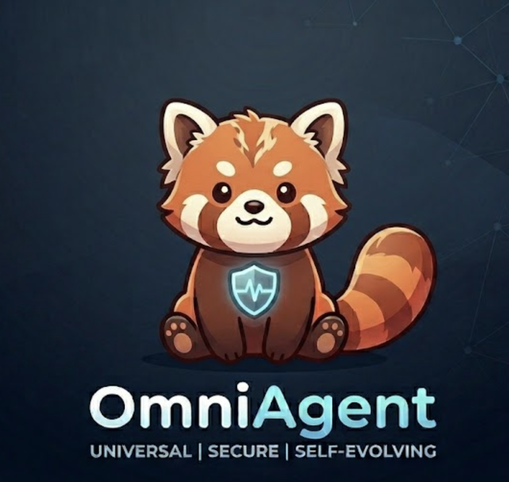

<div align="center">
<p align="center">
  
</p>

# OmniAgent
让Agent随交互持续进化，让安全随使用动态加固

<p align="center">
  <a href="https://yeqing17-2026.github.io/OmniAgent/">Website</a>&nbsp; • &nbsp;
  <a href="https://docs.omniagent.dev">Docs (on the way)</a>&nbsp; • &nbsp;
  <a href="README_CN.md">中文</a>&nbsp; • &nbsp;
  <a href="README.md">English</a>&nbsp; 

  
  
  
</p>


</div>

**OmniAgent** 是一个基于 OpenClaw 设计思想的开源 Agent 框架。是当前唯一实现全维度自进化 (**OmniEvolve**) 的 Agent：  
- **Skill自进化**：通过交互中技能的自动创建、检查、修复，实现了 Skill 的实时自进化  
- **Context自进化**：基于多层信息栈架构，基于对用户实时交互反馈和LLM总结反馈，实时更新记忆与用户偏好，实现了Personalization Memory&Context的自进化
- **BrainModel自进化**：通过新型在线强化学习反馈回路，实现 BrainModel 在交互中动态迭代自进化

基于以上达成了 Agent 全维度（Skill、Context、BrainModel）自进化。 同时全新设计Hyper-Harness 和 Deep Reflexion 模块，提升与保证Agent 系统安全性与任务成功率：
- **Hyper Harness**：一款原创的高效、安全、智能的执行支架，为 OmniAgent 的复杂任务的安全性提供系统支撑 
- **Deep Reflexion**：通过内外双层反思架构，实时风险拦截与失败经验转化，为 OmniAgent 的复杂任务成功率提供系统支撑

---
**OmniAgent** VS **OpenClaw** VS **Hermes**

| 维度 | OpenClaw | Hermes | OmniAgent |
| :--- | :--- | :--- | :--- |
| **Skill 进化模式** | 静态无进化 | 执行结束后**定期**进化（慢） | 执行过程中**实时**自进化（快） |
| **Skill 注入策略** | User Message | User Message | User Message（节约90%token成本） |
| **Context 进化模式** | 静态 Contex 组装，无进化（弱） | 基于 Prompt 指令进化（弱） | 基于实时交互反馈和 LLM 总结反馈自进化（强） |
| **BrainModel 进化模式** | 固定模型，无进化 | 固定模型，无进化 | 自部署模型，在线强化学习进化 | 
| **Harness 安全** | 静态安全扫描（可绕过） | Skill 信任分级策略、静态安全扫描（可绕过）| **Tool&Skill** 信任分级策略、四层安全动态扫描系统（不可绕过） |
| **Hyper Harness** | 无（速度慢）| 无（速度慢） | 动态多智能体、Tool 动态并发执行（速度快） |
| **Agent Loop** | ReAct 单轮循环（成功率低） | ReAct 单轮循环（成功率低） | 内外双层循环 Deep Reflexion （成功率高） |
|


## 核心能力

**OmniEvolve（全维进化）**：Agent 随交互持续进化，安全动态加固。

- **主动式记忆**：基于多层信息栈，通过显式用户反馈与隐式 LLM 归纳的双路对齐机制，实现用户画像与记忆的自主沉淀与持续自进化
- **Skill自进化**：通过对高频 Action 序列的范式提取，实现 Skill 的原生自生成；依托用户交互与 LLM 诊断的双路反馈，实现 Skill 的自动诊断与修复
- **Personalization Context**：通过多维偏好信号的实时捕捉，构建自适应个性化上下文，实现 Agent Loop 与用户个性偏好的精准契合
- **BrainModel自进化**：通过新增的在线强化学习 (GRPO + PRM) 反馈回路，实现 BrainModel 在交互使用中模型闭环自进化

**Hyper Harness（超级脚手架）**：更加高效、安全、智能的 Harness 引擎。

- **渐进式上下文加载**：基于 Anthropic Claude Skills 启发的设计模式——Progressive Disclosure（渐进式披露），按需逐级加载
- **动态多智能体**：新增设计 **Sentinel**（规划）与 **Guardian**（守卫）Agent，动态分析任务的复杂与安全程度，实时激活 **Sentinel** / **Guardian** Agent，提升复杂任务成功率与安全率
- **工具动态并发执行**：自动解析工具间依赖，从串行等待转变为异步并行调用，降低长链路任务的延迟
- **四层动态安全扫描系统**：LLM 智能审查 → 策略引擎 → 交互审批 → 执行沙箱。通过信任分级，不同 Skill 适用不同的安全策略。安全扫描不可被绕过（业内首创）

**Deep Reflection（内外双层反思架构）**：提升 Agent 任务成功率（PASS@1）。

- **Agent Loop 内层失败经验转化至外层**：基于 LLM 通过故障驱动的自动根因分析（RCA）与启发式策略提取，将 Reflexion 动态注入上下文空间，实现内外双层协作闭环反思纠偏与智能重试
- **Agent Loop 内层失败预防机制**：三层失败预防体系（轨迹重复、错误Action重复、Loop 伪终止）监测失败风险并注入上下文，提升任务成功率（PASS@1）

---

## 你可以用 OmniAgent 做什么

| 场景 | OmniAgent 能做什么 |
|------|-------------------|
| **工作区与技能** | 配置文件注入：通过 引导文件（AGENTS.md / SOUL.md / CUSTOM.md）等文件直接定义 Agent 的性格、任务和行为准则；渐进式加载：根据对话深度，分层（L0/L1/L2）读取关联文档，防止 Token 溢出。|
| **编码与开发** | 代码全生命周期处理：支持在本地环境内直接编写、运行、测试代码；自动纠错：运行报错后，Agent 会自动读取 Traceback 信息并尝试修复，直至程序跑通。|
| **调研与分析** | 多维网络搜索：自动调用搜索工具，并深入访问多个网页提取关键信息；知识交叉验证：对比不同来源的信息，输出带有信源标注的综合报告。 |
| **系统运维** | Shell 指令执行：支持在沙箱环境或宿主机执行终端命令；安全控制流：内置安全扫描系统，涉及删除、格式化等高危指令时自动挂起并请求用户审批。 |
| **多端部署** | 全平台网关：统一管理飞书、Discord、Telegram、命令行等渠道的消息路由；会话保持：支持在不同客户端之间无缝切换，保持 Agent 的记忆一致性。 |
| **灵活模型后端** | 混合模型路由：支持自由组合 OpenAI、Claude、DeepSeek、Ollama 等后端；|

---

## 快速开始

**环境要求：** Python 3.11+，LLM API Key（DeepSeek / OpenAI / Anthropic / Ollama / Gemini）。

### 安装

```bash
pip install -e .

# 交互式配置向导 — 选择提供商、输入 API Key，一步到位
omniagent onboard
```

### 三种交互方式

| 方式 | 命令 | 说明 |
|------|------|------|
| **终端** | `omniagent chat` | 终端内交互式对话 |
| **Web UI** | `omniagent serve` | 启动 Gateway，浏览器打开 http://127.0.0.1:18790 |
| **移动端**（飞书 / Discord / Telegram） | `omniagent serve` | 启动 Gateway，并在 `config.yaml` 中配置 Channel，最后在终端打开会话 |

---

## 配置说明

配置分层：默认值 → `~/.omniagent/config.yaml` → 环境变量。

```yaml
providers:
  deepseek:
    api_key: "sk-your-key"
    model_id: deepseek-chat

agent:
  model_provider: deepseek
  reflexion_enabled: true
```

> 完整配置参考：[docs.omniagent.dev](https://docs.omniagent.dev) *(即将上线)*

---

## 架构与项目结构

```
┌──────────────────────────────────────────────────────┐
│  渠道层:  CLI · Web UI · 飞书 · Discord · Telegram     │
└──────────────────────┬───────────────────────────────┘
                       │
┌──────────────────────▼───────────────────────────────┐
│  Gateway  (WebSocket + HTTP · 会话管理)                │
└──────────────────────┬───────────────────────────────┘
                       │
┌──────────────────────▼───────────────────────────────┐
│  Reflexion Agent Loop                                │
│                                                      │
│  ┌─────────────────┐  ┌──────────────────────────┐   │
│  │ Deep Reflexion  │  │ Hyper Harness            │   │
│  │ 反思循环         │  │ ┌────────────────────┐   │   │
│  │ 失败预防机制      │  │ │渐进式上下文加载       │   │   │
│  └─────────────────┘  │ │动态工具执行          │   │   │
│                       │ │四层动态安全扫描      │   │   │
│  ┌─────────────────┐  │ │动态多智能体          │   │   │
│  │ Sentinel Agent  │  │ └────────────────────┘   │   │
│  │ (规划)           │  └──────────────────────────┘   │
│  ├─────────────────┤                                 │
│  │ Guardian Agent  │  ┌──────────────────────────┐   │
│  │ (安全审查)       │  │ OmniEvolve               │   │
│  └─────────────────┘  │ ┌────────────────────┐   │   │
│                       │ │主动式记忆            │   │   │
│                       │ │Skill自进化          │   │   │
│                       │ │Personalization     │   │   │
│                       │ │BrainModel 自进化    │   │   │
│                       │ └────────────────────┘   │   │
│                       └──────────────────────────┘   │
└──────────────────────────────────────────────────────┘
                       │
┌──────────────────────▼───────────────────────────────┐
│  LLM Providers                                       │
│  DeepSeek · OpenAI · Anthropic · Ollama · Gemini     │
│  OpenRouter · vLLM · SGLang · Custom                 │
└──────────────────────────────────────────────────────┘
```

```
omniagent/
├── agents/          # 核心：反思循环、规划、安全审查、技能/记忆进化、上下文管理
├── security/        # 策略引擎、审批、审计、沙箱
├── tools/           # 多个内置工具
├── channels/        # 飞书、Discord、Telegram、Webhook
├── config/          # OmniAgentConfig + 子配置
├── gateway/         # WebSocket + HTTP 服务器
└── rl/              # GRPO + PRM 训练管线
```

---

## 路线图

### 近期计划

- [ ] **四层记忆体系自进化（Proactive Memory 2.0）** — 从对话中自动提取和沉淀长期记忆，完善主动式记忆体系，解决自进化规则间的冲突与优先级问题
- [ ] **扩展渠道生态** — 新增微信、企微、钉钉、大象 等渠道接入，完善渠道抽象层，降低新渠道接入成本
- [ ] **Plan-Mode 编码模式** — 实现全新的 Agent 规划模式，在 Agent 执行复杂任务前生成并确认方案，再逐步执行
- [ ] **多智能体协作增强** — 提升多智能体间的通信与任务编排能力，支持 Agent 间动态委派和结果汇总
- [ ] **文档**

---

## 参与贡献

1. Fork 本仓库并创建特性分支
2. 编写代码并补充测试
3. 运行 `python -m pytest` 验证
4. 提交 Pull Request

欢迎各种形式的贡献 — Bug 修复、新工具、渠道接入、文档改进。

---

## 许可证

本项目基于 [GPL-3.0](https://www.gnu.org/licenses/gpl-3.0.txt) 许可证开源。引用本项目的代码必须以相同许可证开源。

---

<div align="center">

**OmniAgent** — 让Agent的智能随着交互持续进化，让安全动态加固。

</div>
